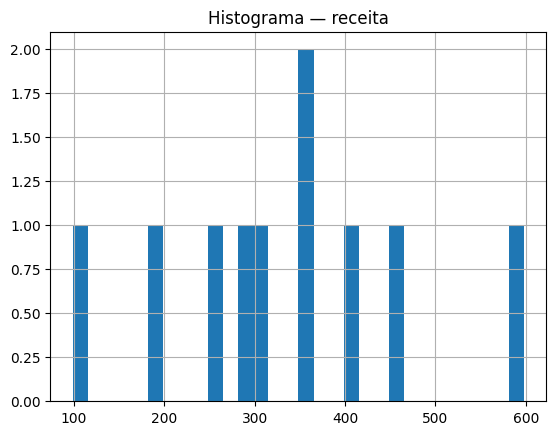

# 02 — Pandas IA Analista

> **Carreira Alura:** Base — *Pensamento computacional + Python IA Aplicada*

Faz EDA (análise exploratória) automática num CSV e usa LLM para gerar **insights narrativos** sobre os dados.

## Stack
| Camada | Tecnologia |
|--------|------------|
| Dados | `pandas` |
| Visualização | `matplotlib` |
| Insights | LLM via `_shared` |

## Como rodar

```bash
pip install -r requirements.txt
python main.py samples/vendas.csv --target receita
# ou rode com seu próprio CSV
python main.py /caminho/para/dados.csv
```

Saída: estatísticas (`describe`), gráficos em `out/`, e um relatório textual gerado pelo LLM com 5 insights e próximos passos.

## Output de exemplo

Rodando contra o CSV de exemplo:

```bash
$ python main.py samples/vendas.csv --target receita
Carregado: 10 linhas × 6 colunas
Relatório salvo em out/relatorio.md
Gráficos: 3 arquivos em out/
```

Histograma gerado automaticamente para a coluna `receita`:



> Sem `OPENAI_API_KEY` o `relatorio.md` traz só um placeholder do `MockLLMClient`. Com a chave configurada, o LLM produz a narrativa de insights real (visão geral, 5 insights, riscos, próximos passos).

## Entregáveis para portfólio
- Pipeline reutilizável de EDA → LLM
- Relatório textual em Markdown salvo em `out/relatorio.md`
- Geração de gráficos (histograma, correlação) automática

## Próximos passos
- Versão Streamlit interativa
- Sugerir feature engineering automático
